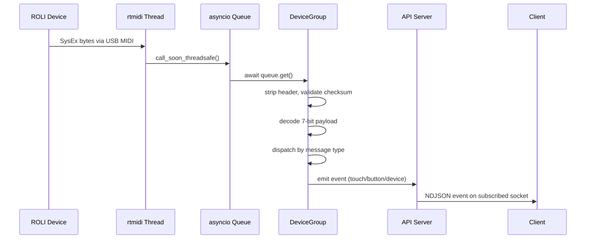
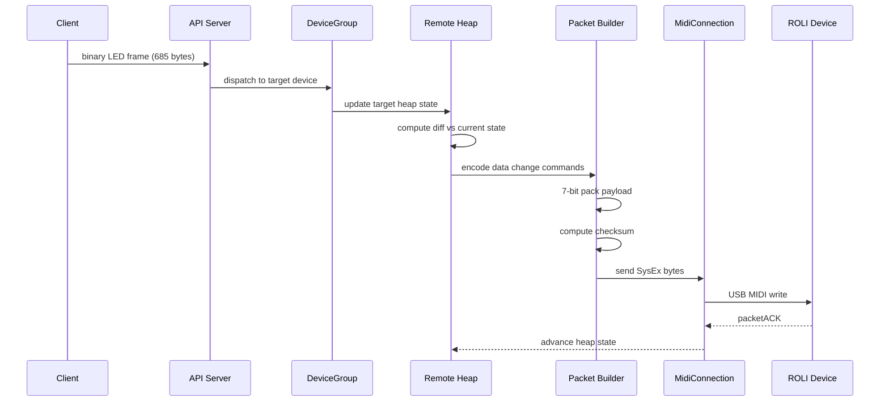
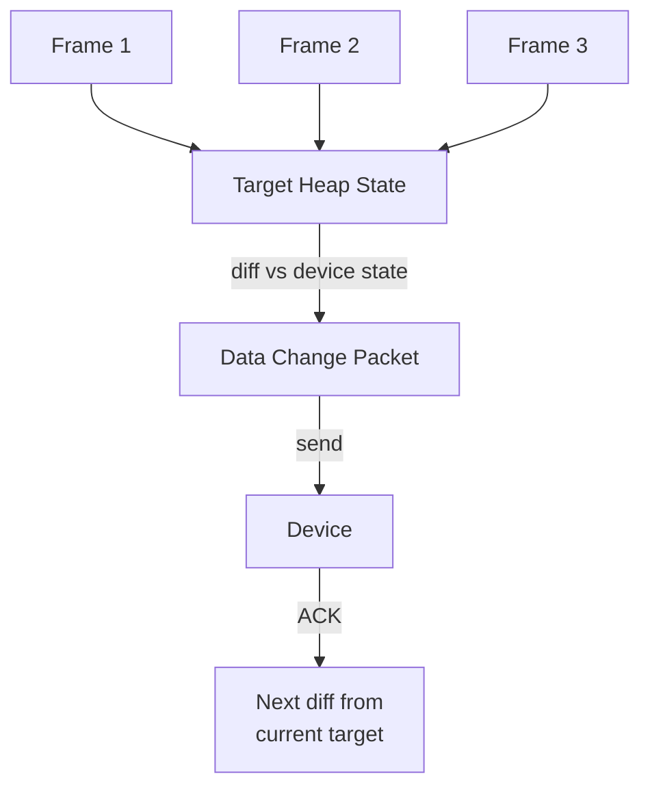
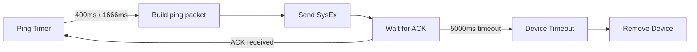

# Data Flow

This page traces the path of every byte through blocksd: from raw USB MIDI SysEx arriving on a background thread, through checksum validation and 7-bit decoding on the event loop, to NDJSON events landing on a subscriber's socket. And the reverse path for LED frames.

## Inbound: Device → Host



### Processing Steps

1. **MIDI callback**: python-rtmidi receives raw bytes on its internal thread
2. **Thread marshal**: the callback pushes data to the asyncio event loop via `call_soon_threadsafe()` and a queue
3. **SysEx parse**: DeviceGroup strips the 5-byte SysEx header and extracts the device index
4. **Checksum validation**: the last payload byte is verified against the computed checksum
5. **7-bit decode**: a `Packed7BitReader` unpacks the payload into typed fields
6. **Message dispatch**: the decoded message is routed to the appropriate handler (topology, ACK, touch, button, config, log)
7. **Event emission**: relevant events are pushed to the EventBroadcaster, which delivers them to subscribed API clients

## Outbound: Host → Device



### LED Frame Pipeline

The LED write path is the most performance-sensitive data flow:

1. **Client sends frame**: 685-byte binary packet (magic + type + uid + 675 RGB888 bytes)
2. **API server dispatches**: looks up the target device by `uid`, validates payload size
3. **Heap update**: the Remote Heap Manager receives the new target pixel data
4. **Diff computation**: compares target state against the last-ACK'd device state
5. **Data change encoding**: the diff is encoded as skip/set/RLE commands
6. **Packet building**: commands are 7-bit packed into a `sharedDataChange` SysEx packet
7. **MIDI write**: the packet is sent over USB MIDI
8. **ACK tracking**: the daemon waits for a `packetACK` before sending the next diff
9. **Coalescing**: if new frames arrive while a write is in-flight, the heap manager merges them into the latest target state rather than queuing each frame

### Frame Coalescing



When the client sends frames faster than the device can accept them, the heap manager doesn't queue them up. It always diffs against the latest target state, which means intermediate frames are automatically skipped. The device always converges to the most recent frame the client sent.

## Keepalive Flow



The keepalive ping is a simple `deviceCommandMessage` with command `0x03`. The device must respond with a `packetACK` within 5 seconds or blocksd considers it disconnected.

## Protocol Pipeline Summary

```
Host                                          Device
 │                                              │
 │  ── Serial Dump Request ──────────────────►  │
 │  ◄─────────────────── Serial Response ────  │
 │  ── Request Topology ─────────────────────►  │
 │  ◄───────────────────── Topology ─────────  │
 │  ── endAPIMode + beginAPIMode ────────────►  │
 │  ◄──────────────────── Packet ACK ────────  │
 │                                              │
 │  ── Ping (400ms master / 1666ms DNA) ─────► │  ← keepalive loop
 │  ◄──────────────────── Packet ACK ────────  │
 │                                              │
 │  ── SharedDataChange (LED data) ──────────► │  ← heap writes
 │  ◄──────────────────── Packet ACK ────────  │
```
