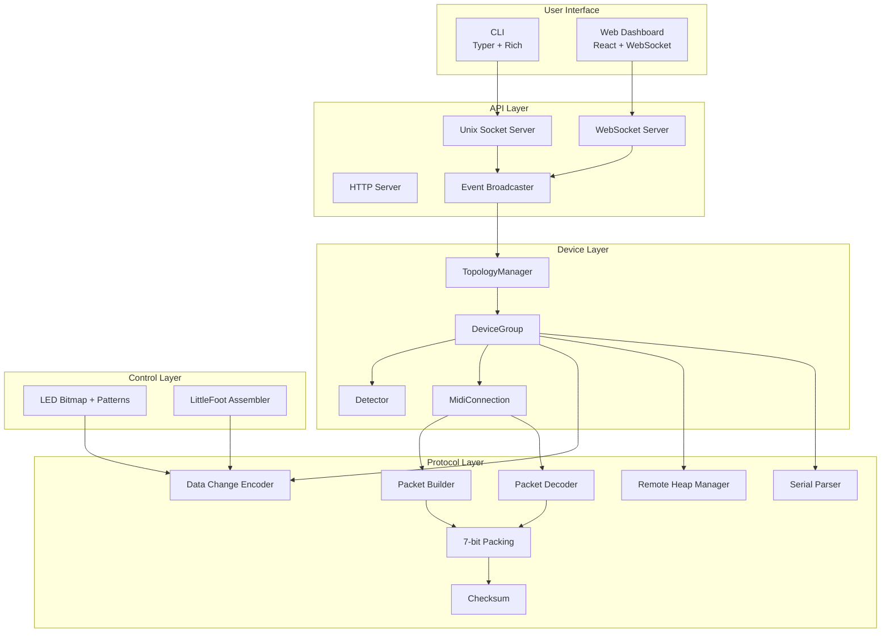

# Architecture Overview

blocksd is about 5,700 lines of Python organized into layered modules with strict boundaries. Protocol logic is pure and testable without hardware. Device lifecycle is async and self-healing. The API layer broadcasts events to subscribers without blocking the core loop.

## Design Principles

**Pure protocol, no I/O.** The `protocol/` package contains zero I/O. Packing, checksums, building, and decoding are pure functions that can be tested without hardware. All MIDI I/O lives in `device/connection.py`.

**One DeviceGroup per USB connection.** Each USB-connected ROLI device gets its own DeviceGroup that manages the full lifecycle: serial request, topology, API activation, keepalive, and cleanup. DNA-connected devices are managed through their master's DeviceGroup.

**asyncio everywhere.** The daemon is single-threaded asyncio. The only thread boundary is the rtmidi callback, which marshals data to the event loop via `call_soon_threadsafe()`.

**Event broadcasting, not polling.** API clients subscribe to event streams (device, touch, button). The EventBroadcaster pushes events to subscribers with bounded queues and automatic cleanup of slow consumers.

## Module Map

| Module        | Size | Responsibility                                                                        |
| ------------- | ---- | ------------------------------------------------------------------------------------- |
| `protocol/`   | 172K | Pure protocol logic: packing, checksums, builder, decoder, data changes, heap manager |
| `api/`        | 124K | Unix socket, WebSocket, HTTP servers, event broadcasting                              |
| `topology/`   | 100K | Device discovery, lifecycle state machine, topology tracking                          |
| `cli/`        | 76K  | Typer CLI: run, status, led, config, install commands                                 |
| `littlefoot/` | 64K  | LittleFoot VM bytecode assembler and programs                                         |
| `device/`     | 48K  | Device models, registry, connection wrapper, config IDs                               |
| `led/`        | 36K  | RGB565 bitmap grid, LED patterns                                                      |
| `config/`     | 12K  | Pydantic config schema, TOML loader                                                   |

See [Module Structure](./modules) for details on each module.
