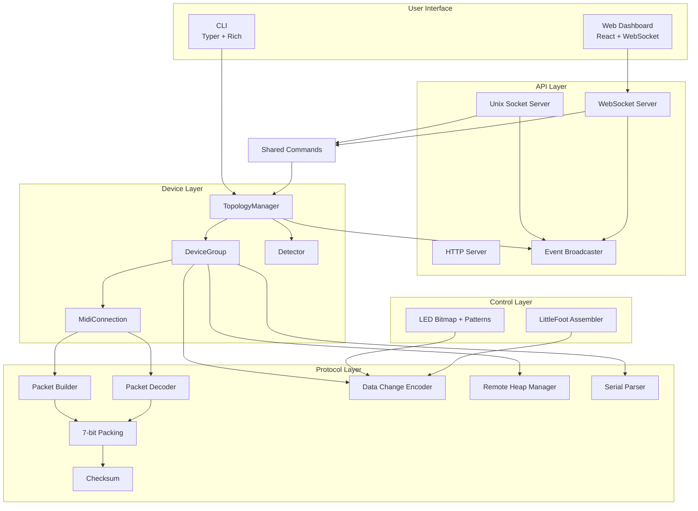

# Architecture Overview

blocksd is organized into layered modules with strict boundaries. Protocol logic is pure and testable without hardware. Device lifecycle is async and self-healing. The API layer broadcasts events to subscribers without blocking the core loop.

```mermaid
graph TB
    subgraph "User Interface"
        CLI[CLI<br/>Typer + Rich]
        WEB[Web Dashboard<br/>React + WebSocket]
    end
    subgraph "API Layer"
        SOCK[Unix Socket Server]
        WSOCK[WebSocket Server]
        HTTP[HTTP Server]
        EVT[Event Broadcaster]
    end
    subgraph "Device Layer"
        TM[TopologyManager]
        DG[DeviceGroup]
        DET[Detector]
        CONN[MidiConnection]
    end
    subgraph "Protocol Layer"
        BUILD[Packet Builder]
        DECODE[Packet Decoder]
        PACK[7-bit Packing]
        CSUM[Checksum]
        DC[Data Change Encoder]
        RH[Remote Heap Manager]
        SER[Serial Parser]
    end
    subgraph "Control Layer"
        LED[LED Bitmap + Patterns]
        LF[LittleFoot Assembler]
    end
    CLI --> TM
    SOCK --> CMD[Shared Commands]
    WSOCK --> CMD
    CMD --> TM
    WEB --> WSOCK
    SOCK --> EVT
    WSOCK --> EVT
    TM --> EVT
    TM --> DG
    TM --> DET
    DG --> CONN
    CONN --> BUILD
    CONN --> DECODE
    BUILD --> PACK
    DECODE --> PACK
    PACK --> CSUM
    DG --> DC
    DG --> RH
    DG --> SER
    LED --> DC
    LF --> DC
```

## Design Principles

**Pure protocol, no I/O.** The `protocol/` package contains zero I/O. Packing, checksums, building, and decoding are pure functions that can be tested without hardware. MIDI transport I/O lives in `device/connection.py`; port enumeration lives in `topology/detector.py`.

**One DeviceGroup per USB connection.** Each USB-connected ROLI device gets its own DeviceGroup that manages the full lifecycle: serial request, topology, API activation, keepalive, and cleanup. DNA-connected devices are managed through their master's DeviceGroup.

**asyncio everywhere.** The daemon is single-threaded asyncio. The only thread boundary is the rtmidi callback, which marshals data to the event loop via `call_soon_threadsafe()`.

**Event subscriptions.** API clients subscribe to device, touch, button, config, and topology events. The EventBroadcaster pushes events to subscribers with bounded queues and automatic cleanup of slow consumers.

## Module Map

| Module        | Responsibility                                                                        |
| ------------- | ------------------------------------------------------------------------------------- |
| `protocol/`   | Pure protocol logic: packing, checksums, builder, decoder, data changes, heap manager |
| `api/`        | Unix socket, WebSocket, HTTP servers, event broadcasting                              |
| `topology/`   | Device discovery, lifecycle state machine, topology tracking                          |
| `cli/`        | Typer CLI: run, status, led, config, install commands                                 |
| `littlefoot/` | LittleFoot VM bytecode assembler and programs                                         |
| `device/`     | Device models, registry, connection wrapper, config IDs                               |
| `led/`        | RGB565 bitmap grid, LED patterns                                                      |
| `config/`     | Pydantic config schema, TOML loader                                                   |

See [Module Structure](./modules) for details on each module.
