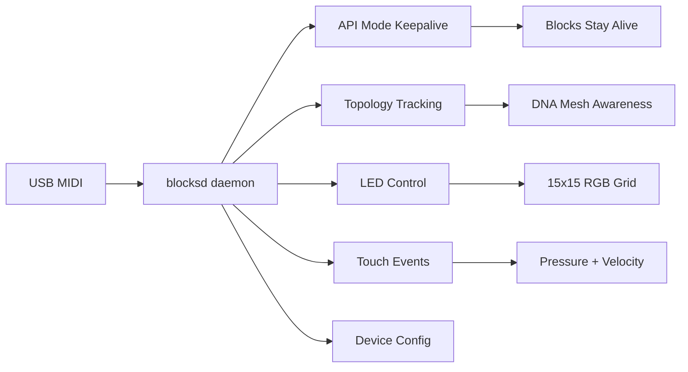

# Introduction

ROLI Blocks are remarkable hardware: pressure-sensitive touch surfaces, 15x15 RGB LED grids, and magnetic DNA mesh networking that lets devices snap together into larger surfaces. They were designed for music production, but the underlying capabilities go far beyond that.

The catch: ROLI only ships drivers for Windows and macOS. Plug a Block into a Linux machine and you get a sad searching animation for about 5 seconds before the device powers off. No API mode activation, no touch events, no LED control, nothing.

**blocksd** fixes this. It implements the complete ROLI Blocks protocol as a Linux daemon, reverse-engineered from JUCE SDK source code and extracted ROLI Connect installers.

## What blocksd Does

| Capability                | What It Means                                                           |
| ------------------------- | ----------------------------------------------------------------------- |
| **API Mode Keepalive**    | Periodic SysEx pings prevent the 5-second timeout that kills API mode   |
| **Topology Management**   | Auto-discovers devices, tracks DNA-connected blocks through master      |
| **Full State Machine**    | Serial, topology, API activation, ping loop, matching the C++ reference |
| **LED Control**           | RGB565 bitmap grid on Lightpad, CLI patterns and binary frame streaming |
| **Touch & Button Events** | Normalized touch data with pressure and velocity, button callbacks      |
| **Device Config**         | Read/write settings like sensitivity, MIDI channel, scale               |
| **DAW Friendly**          | ALSA multi-client, blocksd and your DAW share MIDI without conflict     |
| **systemd Integration**   | Type=notify service, watchdog heartbeat, udev rules                     |

## How It Works

The ROLI Blocks protocol is a MIDI SysEx-based protocol layered on top of standard USB MIDI. All control messages are encoded as SysEx packets with ROLI's manufacturer ID, 7-bit packed payloads, and a custom checksum.

blocksd implements this protocol in pure Python with asyncio, using python-rtmidi for MIDI I/O. The daemon runs a continuous loop that:

1. Scans MIDI ports for devices matching ROLI's naming convention
2. Requests serial numbers and topology information
3. Activates API mode on each discovered device
4. Maintains keepalive pings at the correct intervals (400ms for master, 1666ms for DNA-connected)
5. Exposes device state, touch events, and LED control over Unix socket and WebSocket APIs

## Beyond Music

A 15x15 LED grid you can touch with continuous pressure sensitivity, that magnetically snaps together with other devices. That's not just a MIDI controller. blocksd opens these up as a platform for:

- **Visual dashboards**: CI status boards, system monitors, notification beacons
- **Creative coding**: generative art on a physical LED grid
- **Lighting control**: DMX/ArtNet bridge, Home Assistant integration
- **Accessibility**: pressure-based input, gesture recognition
- **Gaming**: Simon Says, puzzle games, rhythm pads

See the [Vision document](https://github.com/hyperb1iss/blocksd/blob/main/VISION.md) for the full list of use cases.

## Project Status

blocksd is in alpha, but the core feature set is complete and battle-tested on real hardware. The main gap is LittleFoot program upload, blocked by a firmware opcode incompatibility on v1.1.0 devices (the daemon works around this with unrolled fillPixel calls).

| Phase                             | Status                |
| --------------------------------- | --------------------- |
| Protocol Core                     | ✅ Complete           |
| Device Discovery & Topology       | ✅ Complete           |
| API Mode Keepalive                | ✅ Complete           |
| LED Control & Patterns            | ✅ Complete           |
| Touch & Button Events             | ✅ Complete           |
| External API (Socket + WebSocket) | ✅ Complete           |
| Web Dashboard                     | ✅ Complete           |
| systemd + udev                    | ✅ Complete           |
| LittleFoot Program Upload         | 🔄 Blocked (firmware) |
| D-Bus Interface                   | 📋 Planned            |

## Next Steps

- [Install blocksd](./installation) on your Linux system
- [Quick Start](./quick-start) to connect your first device
- Explore the [Protocol Reference](/protocol/) if you're curious about the wire format
