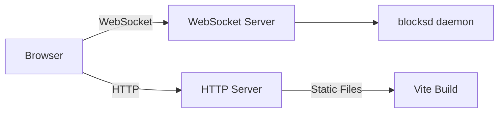

# Web Dashboard

blocksd ships with a real-time web dashboard built on React 19. It shows everything happening with your devices: topology, battery, connections, LED state, live touch events, all updating over WebSocket without page refreshes.

## Launching

```bash
blocksd ui                       # start on default port 9010
blocksd ui --port 8080           # custom port
```

This starts the daemon with the web server and opens your browser to the dashboard. The web UI communicates with blocksd over WebSocket for live updates.

You can also enable the web server permanently by setting `web.enabled = true` in your config file, so it starts automatically with `blocksd run`.

## Dashboard Features

The dashboard shows a live view of your connected devices:

- **Device list**: all connected blocks with type, serial, and connection status
- **Battery monitoring**: current charge level and charging state for each device
- **Topology view**: how devices are connected through DNA mesh networking
- **LED state**: current LED grid contents for Lightpad devices

The dashboard updates in real time. Device connects, disconnects, battery changes, and topology updates all appear instantly without page refresh.

## Architecture

The web dashboard is built with React 19 and communicates with the daemon through the same WebSocket API available to any external client. The static assets are bundled into the Python package at build time.



The HTTP server serves the static React app. The WebSocket connection handles all real-time communication: device events, touch data, and LED frame updates.

## API Access

The web server exposes the same API that the Unix socket provides, over WebSocket at `ws://localhost:9010/ws`. See the [External API reference](/reference/api) for protocol details.
