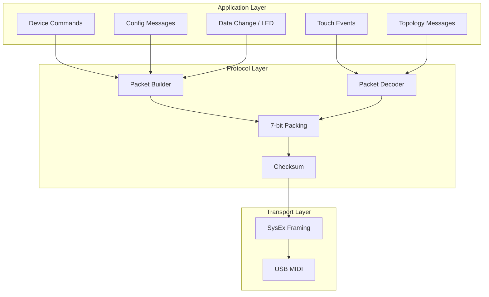

# ROLI Blocks Protocol

ROLI never documented their Blocks protocol. Everything in this section was reverse-engineered from the JUCE SDK source code (the `roli_blocks_basics` module) and the extracted ROLI Connect Electron app.

The protocol is a proprietary binary format layered on top of standard USB MIDI. All control messages are MIDI System Exclusive (SysEx) packets with ROLI's manufacturer ID, 7-bit packed payloads, and a custom checksum. It's compact, efficient, and surprisingly well-designed for what is essentially a bitstream squeezed through a 7-bit pipe.

## Protocol Stack

## Key Concepts

### SysEx Framing

Every message is wrapped in a MIDI SysEx envelope with ROLI's manufacturer ID (`00 21 10`) and a product byte (`77` for Blocks). The first payload byte encodes both the topology index and message direction. See [SysEx Framing](./sysex-framing) for the full format.

### 7-bit Packing

MIDI is a 7-bit protocol: byte values above 127 are reserved for status messages. The Blocks protocol packs arbitrary binary data into 7-bit bytes using an LSB-first scheme where values span byte boundaries as needed. This is the single most critical piece of the protocol to implement correctly, and the #1 source of bugs during development. One off-by-one in the bit cursor and every field after it decodes as garbage. See the [SysEx Framing](./sysex-framing#seven-bit-packing) section for the algorithm.

### Topology Indexing

Each device in a connected topology gets a 7-bit index. Index 0 is the master (USB-connected) device. DNA-connected devices get indices 1+. The broadcast index `63` addresses all devices.

### Bidirectional Messages

Messages flow in both directions. Host-to-device messages include commands (begin/end API mode, ping), configuration writes, LED data, and firmware updates. Device-to-host messages include topology reports, touch events, button events, packet ACKs, and log messages. See [Message Types](./messages) for the full catalog.

## Protocol Constants

| Constant                   | Value                  | Description                  |
| -------------------------- | ---------------------- | ---------------------------- |
| `ROLI_SYSEX_HEADER`        | `F0 00 21 10 77`       | Standard Blocks SysEx header |
| `SERIAL_DUMP_REQUEST`      | `F0 00 21 10 78 3F F7` | Serial number request        |
| `SERIAL_RESPONSE_HDR`      | `F0 00 21 10 78`       | Serial response header       |
| `RESET_MASTER`             | `F0 00 21 10 49 F7`    | Master device reset          |
| `PROTOCOL_VERSION`         | `1`                    | Protocol version byte        |
| `TOPOLOGY_INDEX_BROADCAST` | `63`                   | Broadcast to all devices     |
| `API_MODE_PING_TIMEOUT_MS` | `5000`                 | Device timeout without ping  |

## USB Device Identification

ROLI devices use vendor ID `0x2AF4`. blocksd identifies devices by scanning MIDI port names for "BLOCK" or "Block", then validates against the USB vendor ID via sysfs.

| USB PID  | Device              |
| -------- | ------------------- |
| `0x0100` | Seaboard (original) |
| `0x0200` | Seaboard RISE 25    |
| `0x0210` | Seaboard RISE 49    |
| `0x0700` | Seaboard Block      |
| `0x0900` | Lightpad Block      |
| `0x0E00` | LUMI Keys / Piano M |
| `0x0F00` | ROLI Piano (49-key) |
| `0x1000` | ROLI Airwave Pedal  |

## Deep Dives

- [SysEx Framing](./sysex-framing): packet structure, checksum algorithm, and the 7-bit packing engine
- [Message Types](./messages): complete catalog of all host-to-device and device-to-host messages
- [Topology](./topology): how DNA mesh networking works at the wire level
- [Connection Lifecycle](./lifecycle): the full state machine from port scan to keepalive loop
