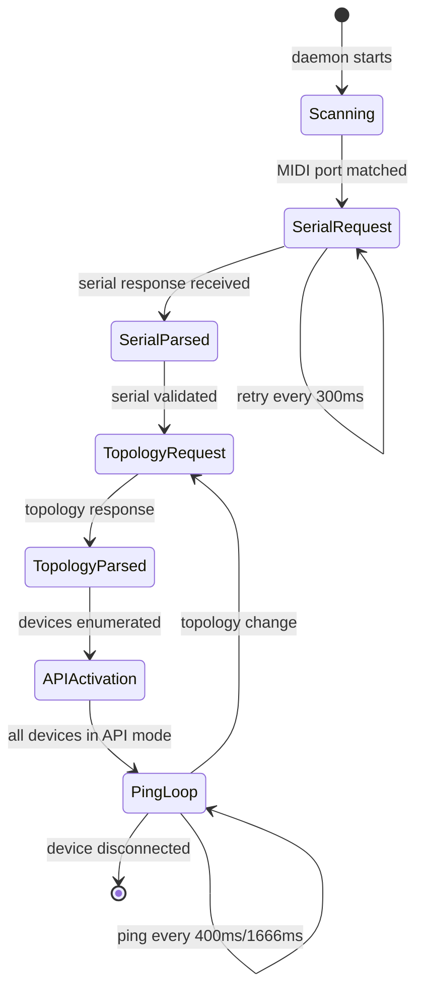
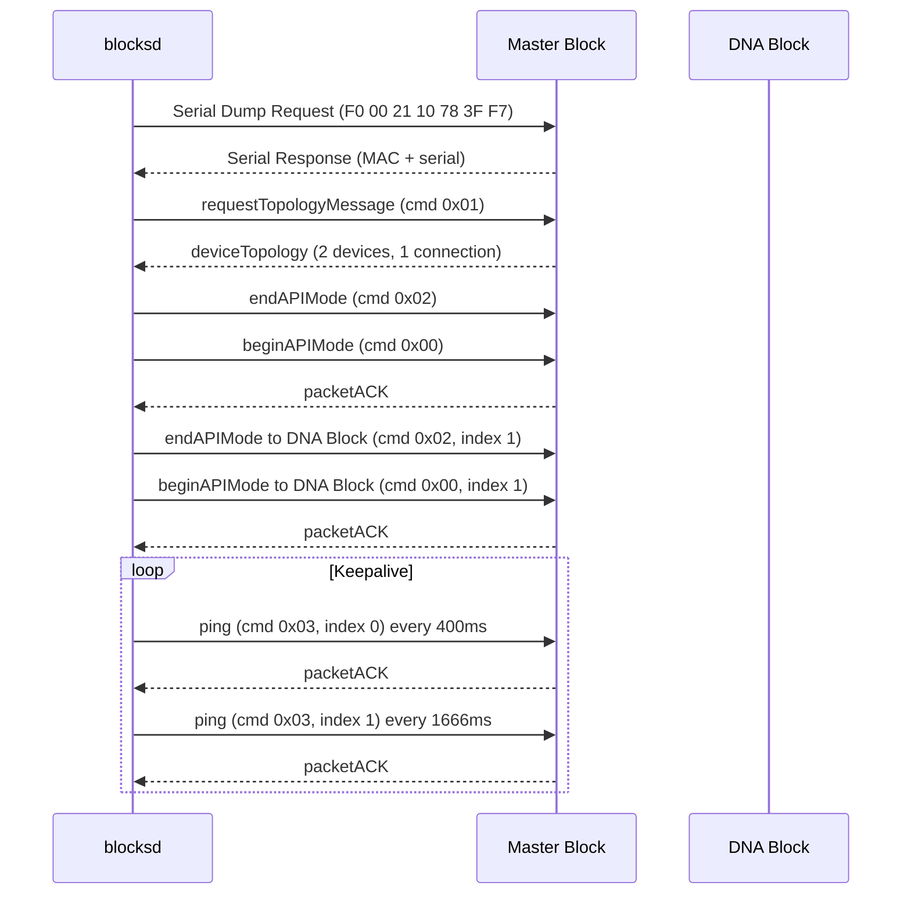
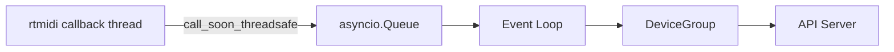

# Connection Lifecycle

This is the heart of blocksd: the state machine that takes a ROLI Block from "just plugged in via USB" to "fully alive with LED control, touch events, and keepalive." Getting this right required matching the exact sequencing and timing of ROLI's C++ implementation in `roli_ConnectedDeviceGroup.cpp`.

## State Machine Overview

## Step by Step

### 1. Scan MIDI Ports

The topology manager polls MIDI ports every 1.5 seconds (configurable via `scan_interval`). It looks for port names containing "BLOCK" or "Block", then validates the USB vendor ID (`0x2AF4`) via sysfs as a secondary check.

### 2. Open MIDI Connection

When a matching port is found, blocksd opens the MIDI input and output pair. The MIDI connection uses python-rtmidi with a callback that marshals incoming messages to the asyncio event loop via `loop.call_soon_threadsafe()`.

### 3. Request Serial Number

blocksd sends the serial dump request: `F0 00 21 10 78 3F F7`. This is retried every 300ms until a response arrives. The response contains a MAC address prefix (`48:B6:20:`) followed by the 16-character serial number.

### 4. Parse Serial and Identify Device

The serial number's first 3 characters identify the device type (LPB = Lightpad, LKB = LUMI Keys, SBB = Seaboard, etc.). blocksd creates a DeviceGroup to manage this USB connection's lifecycle.

### 5. Request Topology

blocksd sends `requestTopologyMessage` (command `0x01`) to device index 0 (the master). The device responds with a `deviceTopology` message containing all connected devices and their physical connections.

### 6. Parse Topology

The topology response is decoded to build a map of all devices in the mesh. Each device gets a topology index, serial number, battery level, and charging state.

### 7. Activate API Mode

For each device not yet in API mode, blocksd sends:

1. `endAPIMode` (command `0x02`): reset any stale API state
2. `beginAPIMode` (command `0x00`): enter rich protocol mode

This sequence is critical. Sending `beginAPIMode` without first sending `endAPIMode` can leave the device in an inconsistent state if it was already partially in API mode.

### 8. Start Ping Loop

Once all devices are in API mode, blocksd starts the keepalive ping loop:

- **Master block**: ping every ~400ms
- **DNA-connected blocks**: ping every ~1666ms

Each ping is a `deviceCommandMessage` with command `0x03`. The device responds with a `packetACK`.

### 9. Monitor ACKs

blocksd tracks the last ACK time for each device. If a device hasn't responded within 5000ms, it's considered disconnected. The daemon removes the device from its internal state and emits a `device_removed` event.

### 10. Handle Topology Changes

If the topology changes (devices added or removed from the DNA mesh), blocksd:

1. Re-requests topology from the master
2. Activates API mode on any new devices
3. Cleans up state for removed devices
4. Emits appropriate events to API clients

## Sequence Diagram

## Error Recovery

The lifecycle is designed to be self-healing:

- **Serial timeout**: retried every 300ms until the device responds
- **Topology timeout**: re-requested after a configurable delay
- **Missed ACK**: device is marked as timed out after 5000ms, then rediscovered
- **MIDI port disappears**: the DeviceGroup is destroyed and all device state is cleaned up
- **Unexpected disconnect**: the daemon continues scanning and will reconnect automatically when the device reappears

## Threading Model

python-rtmidi callbacks arrive on a separate thread. blocksd marshals all incoming MIDI data to the asyncio event loop using `loop.call_soon_threadsafe()` and an `asyncio.Queue`. This ensures all protocol processing happens on the main event loop without locking.

