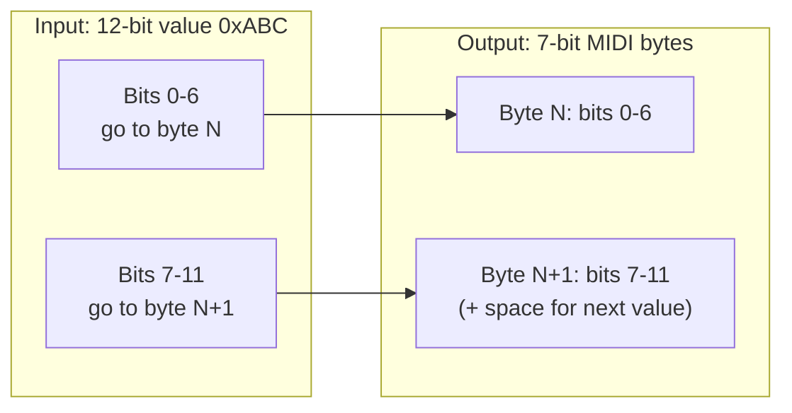

# SysEx Framing

Every byte on the wire between blocksd and a ROLI Block is a MIDI System Exclusive (SysEx) packet. Understanding the framing is essential if you're implementing a client, debugging protocol issues, or just curious about how 32-bit integers get squeezed through a 7-bit pipe.

## Packet Structure

```
F0 00 21 10 77 [deviceIndex] [7-bit packed payload] [checksum] F7
│  │           │  │                                  │          │
│  │           │  └ lower 6 bits = topology index    │          └ SysEx end
│  │           │    bit 6: 0=host→device             │
│  │           │           1=device→host             └ payload checksum & 0x7F
│  │           └ BLOCKS product byte
│  └ ROLI manufacturer ID (3 bytes)
└ SysEx start
```

### Device Index Byte

The byte immediately after the `77` product byte serves double duty:

- **Bits 0-5**: topology index of the target (or source) device (0-62, with 63 as broadcast)
- **Bit 6**: direction flag. `0` means host-to-device, `1` means device-to-host.

For example, a device-to-host message from topology index 0 has device index byte `0x40` (bit 6 set).

### Payload

The payload is 7-bit packed binary data. The first few bits of the payload always contain the message type (7 bits) and protocol version (8 bits). The rest depends on the message type.

## Checksum Algorithm

The checksum covers only the payload bytes (after the device index, before the checksum byte itself). It must be masked to 7 bits for MIDI safety.

```python
def calculate_checksum(data: bytes) -> int:
    checksum = len(data) & 0xFF
    for byte in data:
        checksum = (checksum + (checksum * 2 + byte)) & 0xFF
    return checksum & 0x7F
```

The algorithm seeds with the data length, then iterates through each byte using the recurrence `checksum = checksum * 3 + byte`, all modulo 256. The final result is masked to 7 bits.

## 7-bit Packing {#seven-bit-packing}

MIDI reserves byte values 128-255 for status messages, so all data bytes in a SysEx payload must have bit 7 clear. The Blocks protocol uses a bit-level packing scheme to encode arbitrary binary data within this constraint.

### How It Works

Values are packed LSB-first into a stream of 7-bit bytes. When a value spans a byte boundary, its low bits fill the remaining space in the current byte and its high bits continue into the next byte's low bits.



### Packing Example

To pack two values into the 7-bit stream:

1. A 7-bit message type, say `0x01` (1 decimal)
2. An 8-bit protocol version, say `0x01`

The packer maintains a bit cursor. It writes bits LSB-first:

- Message type `0x01` occupies bits 0-6 of byte 0: `byte[0] = 0x01`
- Protocol version `0x01` starts at bit 7. Its bit 0 goes to bit 7 of byte 0, but that would set bit 7 (illegal). Instead, the packer fills byte 0's remaining capacity (0 bits remain) and moves to byte 1.
- Since the 7-bit message type exactly fills byte 0, the 8-bit protocol version starts fresh at byte 1: `byte[1] = 0x01`, with the top bit spilling to byte 2: `byte[2] = 0x00`.

The result is three bytes: `01 01 00`.

### Bit Size Reference

Each field in the protocol has a fixed bit width:

| Field                | Bits |
| -------------------- | ---- |
| MessageType          | 7    |
| ProtocolVersion      | 8    |
| PacketTimestamp      | 32   |
| TimestampOffset      | 5    |
| TopologyIndex        | 7    |
| DeviceCount          | 7    |
| ConnectionCount      | 8    |
| BatteryLevel         | 5    |
| BatteryCharging      | 1    |
| ConnectorPort        | 5    |
| TouchIndex           | 5    |
| TouchPosition.x      | 12   |
| TouchPosition.y      | 12   |
| TouchPosition.z      | 8    |
| TouchVelocity        | 8    |
| DeviceCommand        | 9    |
| ConfigCommand        | 4    |
| ConfigItemIndex      | 8    |
| ConfigItemValue      | 32   |
| ControlButtonID      | 12   |
| PacketCounter        | 10   |
| PacketIndex          | 16   |
| DataChangeCommand    | 3    |
| ByteCountFew         | 4    |
| ByteCountMany        | 8    |
| ByteValue            | 8    |
| ByteSequenceCont     | 1    |
| FirmwareUpdateACK    | 7    |
| FirmwareUpdateDetail | 32   |
| FirmwareUpdateSize   | 7    |

## Serial Number Request

Serial number requests use a separate SysEx format with product byte `78` (instead of `77`):

- **Request**: `F0 00 21 10 78 3F F7`
- **Response header**: `F0 00 21 10 78`

The response contains a MAC address prefix `48:B6:20:` followed by a 16-character serial number. The first three characters of the serial identify the device type:

| Prefix        | Device Type                       |
| ------------- | --------------------------------- |
| `LPB` / `LPM` | Lightpad Block / Lightpad Block M |
| `SBB`         | Seaboard Block                    |
| `LKB`         | LUMI Keys Block                   |
| `LIC`         | Live Block                        |
| `LOC`         | Loop Block                        |
| `DCB`         | Developer Control Block           |
| `TCB`         | Touch Block                       |

## Incoming Packet Processing

When receiving a SysEx packet from a device:

1. Strip the 5-byte SysEx header (`F0 00 21 10 77`)
2. The next byte is the device index (extract topology index from bits 0-5)
3. The remaining bytes are payload + checksum (last byte is the checksum)
4. Validate the checksum against the payload bytes
5. Create a 7-bit reader from the payload (excluding checksum) and decode the message
