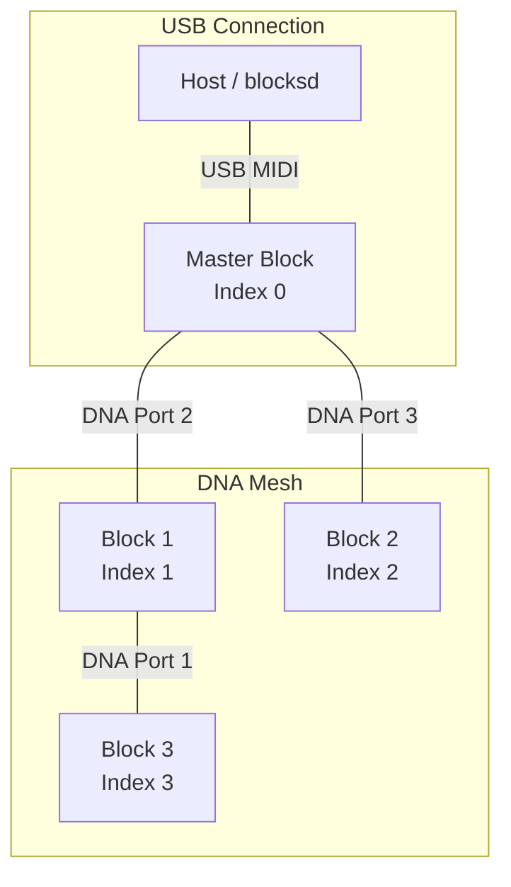

# Topology

ROLI's DNA mesh networking is one of the most interesting parts of the Blocks hardware. Devices snap together with magnets and form a connected topology automatically. The master device (whichever block is USB-connected) reports the entire mesh to the host, including which ports connect to which neighbors, battery status, and charging state.

## Topology Request

The host requests topology by sending a `deviceCommandMessage` with command `0x01` (requestTopologyMessage) to device index 0 (the master).

## Topology Response Format

The `deviceTopology` message (type `0x01`) contains:

1. **Device count** (7 bits): number of devices in the topology
2. **Connection count** (8 bits): number of physical connections between devices
3. **Device info blocks**: one per device
4. **Connection info blocks**: one per connection

### Device Info Block

Each device in the topology is described by:

| Field            | Bits          | Description                              |
| ---------------- | ------------- | ---------------------------------------- |
| Serial number    | 16 x 7b chars | 16-character device serial               |
| Battery level    | 5             | 0-31 battery percentage (maps to 0-100%) |
| Battery charging | 1             | Whether the device is currently charging |

The serial number's first 3 characters identify the device type (see [SysEx Framing](./sysex-framing#serial-number-request)).

### Connection Info Block

Each physical connection between two devices is described by:

| Field          | Bits | Description                                       |
| -------------- | ---- | ------------------------------------------------- |
| Device 1 index | 7    | Topology index of the first device                |
| Device 1 port  | 5    | Port number on device 1 (clockwise from top-left) |
| Device 2 index | 7    | Topology index of the second device               |
| Device 2 port  | 5    | Port number on device 2                           |

Ports are numbered clockwise starting from the top-left of each device. The port numbering depends on the physical shape of the block.

## Multi-Packet Topology

A single topology packet can hold up to 6 devices and 24 connections. For larger topologies, the protocol uses multi-packet responses:

1. `deviceTopology` (0x01): first packet with initial devices and connections
2. `deviceTopologyExtend` (0x04): continuation packets with more devices/connections
3. `deviceTopologyEnd` (0x05): signals the end of the topology report

blocksd assembles these into a complete topology view before processing.

## DNA Mesh Networking

The master block is always the USB-connected device (topology index 0). All other blocks in the mesh are DNA-connected through the master. Messages to non-master blocks are routed through the master automatically.

### Ping Intervals

Different ping intervals apply based on connection type:

| Connection    | Ping Interval | Reason                                         |
| ------------- | ------------- | ---------------------------------------------- |
| Master (USB)  | ~400ms        | Direct USB connection, fast round-trip         |
| DNA-connected | ~1666ms       | Messages routed through master, higher latency |

All devices share the same 5000ms timeout. If a device doesn't receive a ping within 5 seconds, it exits API mode and reverts to basic MIDI.

## Topology Changes

The topology can change at any time as devices are added or removed from the DNA mesh. blocksd handles this by:

1. Detecting when a device appears or disappears from the topology report
2. Re-requesting topology after any change
3. Activating API mode on newly discovered devices
4. Removing state for disconnected devices
5. Emitting `device_added` and `device_removed` events to API clients
